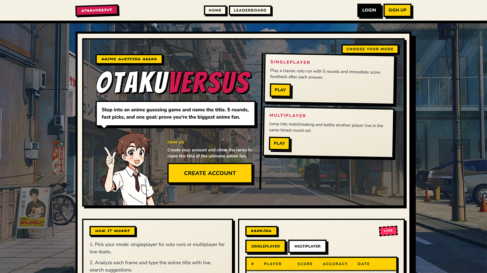

# OtakuVersus


OtakuVersus is a manga-styled anime guessing game with both singleplayer and real-time multiplayer modes.  
Players identify anime titles from scene images, earn points, and compete in rankings.



---

## Table of Contents

- [Core Features](#core-features)
- [Tech Stack](#tech-stack)
- [Project Structure](#project-structure)
- [Product Highlights](#product-highlights)
- [Technical Decisions](#technical-decisions)
- [How to Add Anime (Contributor Workflow)](#how-to-add-anime-contributor-workflow)
- [Architecture Notes](#architecture-notes)
- [Roadmap](#roadmap)

---

## Core Features

- ✅ JWT authentication (register, login, current user)
- ✅ Guest play support (no account required)
- ✅ Singleplayer sessions (score-based)
- ✅ Multiplayer matchmaking with shared rounds
- ✅ Pre-match countdown and synchronized round timer
- ✅ Result comparison vs opponent
- ✅ ELO ranking for multiplayer accounts
- ✅ Separate leaderboards:
- ✅ Singleplayer score leaderboard
- ✅ Multiplayer ELO leaderboard
- ✅ User match history with mode filtering
- ✅ Anime titles and scenes seeded into PostgreSQL via Prisma

---

## Tech Stack

### Frontend

- ⚛️ React 19
- 🔷 TypeScript
- ⚡ Vite
- 🎨 Tailwind CSS
- 🧭 React Router
- 📦 TanStack Query

### Backend

- 🟢 Node.js
- 🚏 Express
- 🔷 TypeScript
- 🔺 Prisma ORM
- 🐘 PostgreSQL

### Additional

- 🔐 JWT auth
- 🗂️ Storage abstraction layer (`noop` / Cloudinary / Supabase Storage)
- ▲ Frontend deploy-ready for Vercel
- 🚄 Backend deploy-ready for Railway/Render

---

## Project Structure

```text
OtakuVersus/
  client/
    src/
      api/
      app/
      components/
        game/
        ui/
      features/
        auth/
        game/
        history/
        leaderboard/
      layouts/
      pages/
      routes/
      styles/
      types/
      utils/
    public/
    .env.example
    package.json

  server/
    prisma/
      migrations/
      schema.prisma
      seed.ts
    src/
      app/
      config/
      lib/
      middleware/
      modules/
        auth/
        users/
        game/
        leaderboard/
        anime-scenes/
      storage/
      types/
      utils/
    .env.example
    package.json

  package.json
  README.md
```

---

## Product Highlights

- 🎮 End-to-end gameplay loop with persisted sessions and post-match breakdown.
- 🏆 Two ranking systems: score-based singleplayer and ELO-based multiplayer.
- 👤 Guest flow and authenticated flow coexisting in one codebase.
- 🧠 Server-authoritative multiplayer scoring and ELO calculation.
- 🎨 Manga-styled UI system kept consistent across pages and game states.

---

## Technical Decisions

- 🧩 Domain-oriented backend modules (`auth`, `game`, `leaderboard`, `users`, `anime-scenes`) for maintainability.
- 🗃 Prisma + PostgreSQL with migrations and seed data to keep schema/content reproducible.
- ⚡ TanStack Query for predictable async state, caching, and refetch patterns.
- 🧠 In-memory caching for external anime metadata to reduce API calls and improve response time.
- 🧱 Reusable UI primitives (`Button`, `Card`, `Modal`, `Loading`) to avoid style drift.

---

## How to Add Anime (Contributor Workflow)

This section describes how to add new anime content as part of an official release contribution.

### 1. Add scene assets

Put exactly 3 images per anime in:

- `client/public/images/scenes`

Use naming:

- `<Anime Title>_1.png`
- `<Anime Title>_2.png`
- `<Anime Title>_3.png`

Supported extensions: `.png`, `.jpg`, `.jpeg`, `.webp`.

### 2. Update seed source of truth

Edit:

- `server/prisma/seed.ts`

Changes:

- Add title to `animeCatalog` or `additionalAnimeTitles`.
- Add scene entry to `scenes`:
  - `anime: '<Anime Title>'`
  - `difficulty: DifficultyLevel.EASY | MEDIUM | HARD`

Important:

- `anime` in `scenes` must exactly match image filename title.
- Keep enough unique anime for session generation.

### 3. Rebuild local dataset

```bash
npm run prisma:seed --workspace server
```

If schema changed:

```bash
npm run prisma:migrate --workspace server
npm run prisma:seed --workspace server
```

### 4. Validate before PR

- Start app and play multiple sessions.
- Confirm title appears in round pool and answer suggestions.
- Confirm slider loads all 3 images for the added title.
- Confirm no seed/runtime errors in backend logs.

### 5. Include in release PR

Commit:

- new files in `client/public/images/scenes`
- `server/prisma/seed.ts` updates

In PR description include:

- list of added anime
- selected difficulty per anime
- quick gameplay proof (screenshots/video)

---

## Architecture Notes

- Domain-based Express modules keep backend features isolated and maintainable.
- Prisma schema is the single source of truth for data shape and relations.
- TanStack Query handles async state and cache on the frontend.
- Auth context keeps JWT flow simple and explicit.
- Multiplayer and ELO are implemented server-side to keep scoring authoritative.

---

## Roadmap

- WebSocket/SSE multiplayer events instead of polling
- Admin scene management panel with upload/moderation workflow
- Background image optimization pipeline (format conversion + resizing)
- Seasonal multiplayer ladder with soft reset and reward tiers
- User profile avatars with upload + preset avatar pack
- In-game achievements and account progression badges
- Activate difficulty-based score multipliers for `EASY`, `MEDIUM`, and `HARD`

---

## License

This project is proprietary and licensed as **All Rights Reserved**.  
Commercial use is not permitted without explicit written permission.
